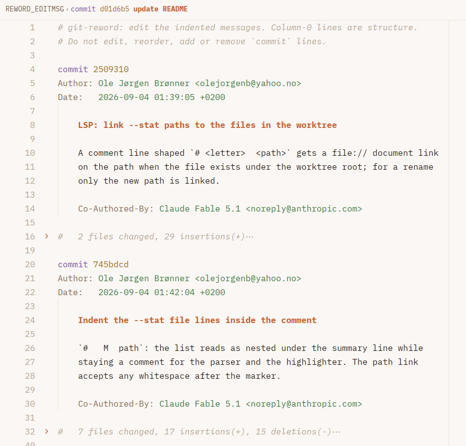

# git-reword

Bulk edit git commit messages in your editor.

```
git reword                  # all commits on the current branch
git reword abc123           # a single commit
git reword HEAD~5..HEAD     # a range
```

Commit messages for the range are written to `REWORD_EDITMSG` at the
worktree root, opened in `$EDITOR`, and the changed ones are applied by
writing new commit objects (`git commit-tree`) and moving `HEAD` once. The
index and the working tree are never touched, so a dirty worktree is fine.
`HEAD@{1}` and `git reset --soft` get the old history back. The file is
transient; the tool adds its name to `.git/info/exclude` on first use
unless `.gitignore` already covers it.

The file looks like `git log` output. Column 0 is structure, indented lines
are the message:

```
commit 7dcfdad1afb39b697a8632f0c450c555abe7d5b6
Author:     Ole Jørgen Brønner <ole@example.com>
AuthorDate: 2026-02-25 05:59:29 +0100

    test-env-cli: refactor the CLI interface

    The previous subcommand-based interface made it difficult to
    perform multiple operations in a single invocation.
```

---



---

`#` lines at column 0 are comments. Inside a message, `#` is just content.
The full format is specified in `prose/spec/reword-format.md`.

Flags:
- `--commit-link` adds a forge URL comment per commit
- `--author-info` adds `Author:` and `AuthorDate:` lines
- `--commit-info` adds `Commit:` and `CommitDate:` lines, the committer
- `--edit-info` makes the info lines editable (implies `--author-info`): a
  run of commits made with the wrong email is then a search and replace.
  Every info line in the file is applied as written, so with
  `--commit-info` rewritten commits keep their committer and committer
  date instead of being stamped anew. The file records the mode in a
  `# git-reword-options: edit-info` line, which is how the language server
  and `--continue` know about it
- `--stat` adds the files each commit touched as comment lines after the message
- `--no-abbrev` writes full shas instead of git's abbreviations (`--abbrev`, the default)
- `--continue` reopens the file from an aborted run
- `--force` discards any previous aborted run
 
Abbreviated shas are resolved against the commits of the range when the file is 
read back; an ambiguous or unknown prefix is an error.

Merge commits are kept, and their messages can be reworded like any other
commit's. Commits after the range up to `HEAD` are carried along onto the
new history; commits before the first change keep their sha. The range
must be in `HEAD`'s history.

## Language server

`git-reword-lsp` speaks LSP over stdio and finds the repository by walking up
from the file, so it works on `REWORD_EDITMSG` and on `.reword` files
anywhere inside a worktree. It provides:

- diagnostics: format errors with quick-fixes, subject length, unknown shas,
  and a hint on every commit whose message changed
- document symbols (outline): one per commit, subject plus short sha
- hover on a `commit` line: author, committer, dates, original message
- code actions: revert a commit to its original message, reflow the
  paragraph under the cursor to 72 columns, indent misindented lines, open
  the commit in the forge (from `origin`), and in Zed open it in Zed's
  commit view
- document links on shas, and formatting that normalises indentation
- folding ranges that keep the subject visible: fold the body under a
  subject, or a whole block down to its `commit` line with the subject as
  placeholder; runs of comment lines fold to their first line, so a
  `--stat` block collapses to its summary (Zed needs
  `document_folding_ranges: "on"` for the language)

Opening a commit uses `window/showDocument` when the editor supports it.
Zed does not, so there the server runs `xdg-open` (or `open` on macOS) for
forge URLs and the `zed` CLI for `zed://git/commit/...` URLs; `zed` must be
on the PATH the server sees.

## Development

```
uv sync
uv run pytest
uv run ruff check
uv run ty check
```

## Disclaimer

This is a vibe-coded project in the sense that I have read little of the code.
